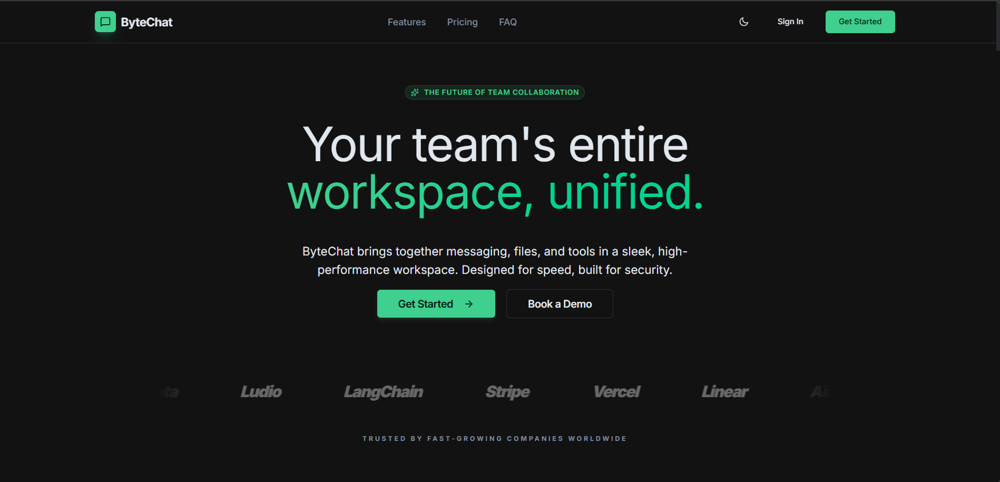
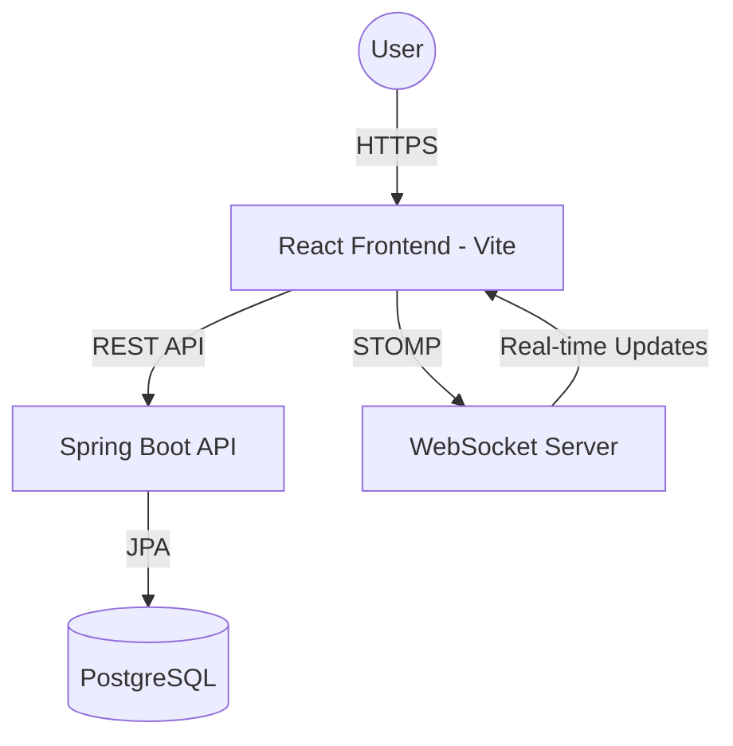

# <p align="center"></p>

<p align="center">
  <strong>A modern, high-performance Slack alternative built for team collaboration.</strong>
</p>

<p align="center">
  
  
  
  
</p>

---

<p align="center">
  
</p>

## 🚀 Overview

ByteChat is an enterprise-grade chat application designed for modern teams. It features a sleek **Emerald-Green** design system, real-time messaging, multi-workspace management, and advanced notification handling. Built as a monorepo, it combines a high-speed React frontend with a robust Java Spring Boot backend.

## ✨ Key Features

- **💬 Real-time Messaging**: Instant communication powered by WebSockets (STOMP).
- **🏢 Workspace Management**: Create, join, and manage multiple team environments.
- **🔒 Secure Authentication**: JWT-based auth with secure cookie storage.
- **🔔 Smart Notifications**: Context-aware system alerts and push notifications.
- **🎨 Premium UI**: Glassmorphism and smooth animations using Framer Motion and shadcn/ui.
- **🐳 DevOps Ready**: Full Docker & Docker Compose support for easy deployment.
- **🔄 CI/CD**: Automated testing and builds via GitHub Actions.

## 🛠 Tech Stack

| **Layer**          | **Technology**                                                                 |
|-------------------|---------------------------------------------------------------------------------|
| **Frontend**      | React 19, Vite, TypeScript, Tailwind CSS, shadcn/ui, Framer Motion, Redux Toolkit |
| **Backend**       | Java 21, Spring Boot 3.2+, Spring Security, JWT, WebSocket (STOMP), Maven       |
| **Database**      | PostgreSQL 15, Redis                                                            |
| **Infrastructure**| Docker, Docker Compose, GitHub Actions, AWS (EC2/RDS)                          |

## 📐 Architecture



## 🚀 Quick Start

### Prerequisites
- Docker & Docker Compose
- Node.js 20+
- JDK 21 & Maven

### Automated Setup
The easiest way to get started is using our Bash automation scripts:

1. **Initialize Project**:
   ```bash
   ./scripts/setup.sh
   ```

2. **Launch Dev Environment**:
   ```bash
   ./scripts/dev.sh
   ```

## 📁 Project Structure

```text
bytechat/
├── apps/
│   ├── frontend/        # React + Vite Application
│   └── backend/         # Java Spring Boot API
├── kubernetes/          # K8s manifests for orchestration
├── docker/              # Production Dockerfiles
├── scripts/             # Automation & Deployment scripts
├── .github/             # CI/CD Workflows
└── docker-compose.yml   # Local orchestration
```

## 🌍 Deployment

For production deployment instructions, including AWS setup, please refer to:
- [DEPLOYMENT.md](./DEPLOYMENT.md)
- [AWS_DEPLOYMENT.md](./AWS_DEPLOYMENT.md)

---

## 🤝 Contributing

We love contributions! Please see our [CONTRIBUTING.md](./CONTRIBUTING.md) for guidelines on how to get started.

## 📝 License

This project is licensed under the MIT License - see the [LICENSE](./LICENSE) file for details.

---

<p align="center">
  Built with ❤️ for the Open Source Community.
</p>
